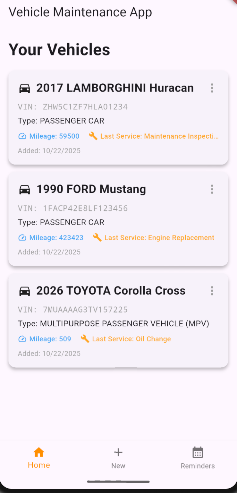

# Vehicle Maintenance App

A Flutter project for CSC 4360/6360.

A vehicle Maintenance App, that utilizes sqlite for local storage and NHTSA for vehicle api

#### Contributors:
- [Systemized](https://github.com/systemized)
- [Pjasmat](https://github.com/pjasmat)



Prerequisites
---
- Flutter SDK
- Android Studio (have an emulator running for sqlite to work)

Install & Run
---
1. Clone repo and cd
    ```bash
    git clone https://github.com/Systemized/Vehicle-Maintenance-App.git
    cd Vehicle_Maintenance_App
    ```
1. Install dependencies
    ```bash
    flutter pub get
    ```
2. Run
    ```bash
    flutter run
    ```